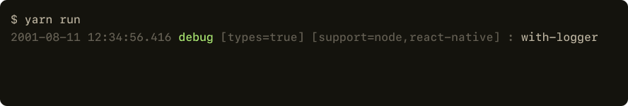

  

## Installation

[npmjs.com/package/with-logger](https://www.npmjs.com/package/with-logger)

```bash
# yarn
$ yarn add with-logger

# npm
$ npm install with-logger
```

## Usage

Use it like `console`:

```typescript
import { logger } from "with-logger";

const metadata = { 
    userId: "2e01d247-1dc1-4d39-a287-f8a069544d43",
    location: "San Francisco, CA"
};

logger.info("👋 Hello World");
// 2021-01-01 12:34:56.416 info : 👋 Hello World

logger.debug("User metadata", metadata);
// 2021-01-01 12:34:56.416 debug : User metadata {
//   userId: "2e01d247-1dc1-4d39-a287-f8a069544d43",
//   location: "San Francisco, CA"
// }

logger.with({ userId: metadata.userId  }).info("User changed location to", newLocation);
// 2021-01-01 12:34:56.416 info [userId=2e01d247-1dc1-4d39-a287-f8a069544d43] : User changed location to Menlo Park, CA

logger.with({ metadata }).warn("Failed to sync user location");
// 2021-01-01 12:34:56.416 info [userId=2e01d247-1dc1-4d39-a287-f8a069544d43] [location=San Francisco, CA] : Failed to sync user location

try {
    perform();
} catch (error) {
    logger.with({ session }).error(error);
}
// 2021-01-01 12:34:56.416 error [id=6033bda3-1a63-44a9-97f1-e15e097c98c0] : Unable to reach server
```

------
August 2021 - Toronto
